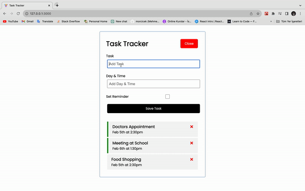

# Task Tracker

This is an application that I use React.js to track my task.

## Table of contents

- [Overview](#overview)
  - [Screenshot](#screenshot)
  - [Links](#links)
- [My process](#my-process)
  - [Built with](#built-with)
  - [What I learned](#what-i-learned)
  - [Continued development](#continued-development)
- [Author](#author)

## Overview

### Screenshot



### Links

- Live Site URL: [Live Site](https://task-track-react.netlify.app/)

## My process

### Built with

- CSS custom properties
- Flexbox
- Sass-CSS preprocessor
- Responsive Design
- React.js Basics
- React.js Components
- React.js useState
- React.js props

### What I learned

I learned essential parts of React JS at this challenge such as props add components.Also I reinforced my knowledge about Bootstrap.
Apart from these I reviewed React.js basics and essentials.
To see how you can add code snippets, see below:

- HTML

```html
<body>
  <div id="root"></div>
  <script type="module" src="/src/main.jsx"></script>
</body>
```

- CSS

```scss
.card {
  position: relative;
}

.icon {
  position: absolute;
  top: 40px;
  right: 50px;
  cursor: pointer;
}
```

- JSX

```jsx
import { useState } from 'react';
import './App.css';
import Header from './components/Header';
import Inputs from './components/Inputs';
import TaskList from './components/TaskList';

function App() {
  const [showInputs, setShowInputs] = useState(false);
  const [tasks, setTasks] = useState([
    {
      id: 1,
      text: 'Renewal Gym Membership',
      day: 'Nov 5th at 11:30am',
      reminder: true,
    },
    {
      id: 2,
      text: 'Register for School',
      day: 'Nov 6th at 2:30pm',
      reminder: false,
    },
    {
      id: 3,
      text: 'Change the Appointment',
      day: 'Nov 3rd at 2:30pm',
      reminder: true,
    },
  ]);

  const handleShowTask = () => {
    setShowInputs(!showInputs);
  };
  return (
    <div className="container border border-secondary rounded-2 mt-4 mw-50">
      <Header showInputs={showInputs} handleShowTask={handleShowTask} />
      <Inputs setTasks={setTasks} tasks={tasks} showInputs={showInputs} />
      <TaskList tasks={tasks} setTasks={setTasks} />
    </div>
  );
}

export default App;
```

### Continued development

- Responsive Design
- Bootstrap
- React

### Useful resources

- [React Documentation](https://react.dev/)
- [Bootstrap](https://getbootstrap.com/)

## Author

- Github - [morcicek](https://github.com/morcicek)
- Linkedin - [Mehmet Cevat Morcicek](https://linkedin.com/in/mehmet-cevat-morcicek-b50a29178)
- Twitter - [@morcicek_m](https://twitter.com/morcicek_m)
